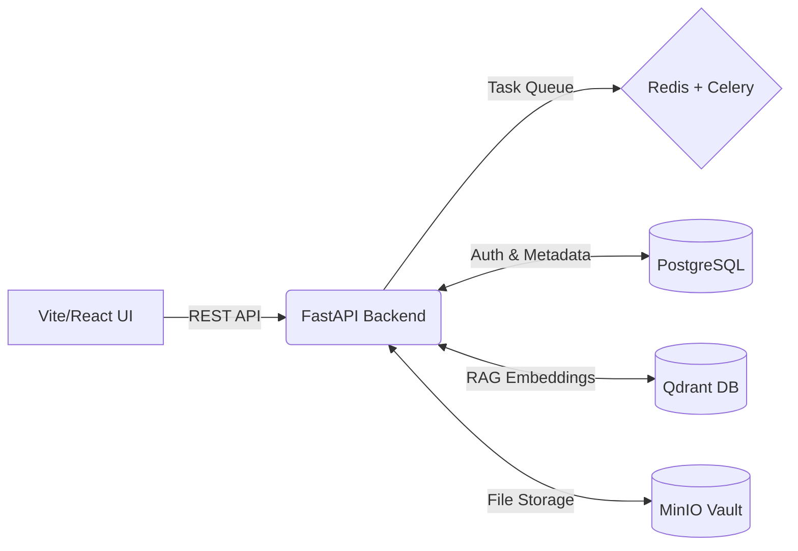

<div align="center">
  
# 💎 PRISM AI
**Offline-First Multimodal Content Transformation Platform**


> Prism AI allows users to input prompts, attach source documents (PDF, DOCX, TXT, images, audio), configure precise parameters, and instantly generate, preview, and export content across multiple formats (**DOCX, PPTX, PDF, Images, Video Scripts**).

</div>

---

## 📑 Table of Contents
- [🌟 Key Platform Features](#-key-platform-features)
- [🏗️ Architecture & Data Flow](#️-architecture--data-flow)
- [🚀 Quick Start & Installation](#-quick-start--installation)
  - [1. Infrastructure (Docker)](#1-infrastructure-docker)
  - [2. Backend (FastAPI)](#2-backend-fastapi)
  - [3. Frontend (React/Vite)](#3-frontend-reactvite)
- [💻 Usage & Workflows](#-usage--workflows)
- [📂 Project Directory Structure](#-project-directory-structure)
- [🔒 Security & Privacy Statement](#-security--privacy-statement)

---

## 🌟 Key Platform Features

- **100% Offline Privacy & Speed**: Operates entirely locally with zero external data transmission for maximum security. Seamlessly scalable to cloud deployments when requested.
- **Task-Specialized Local Fine-Tuned LLMs**: Routes lighter tasks to smaller, optimized models to minimize power consumption, optimize compute efficiency, and accelerate generation times.
- **Few-Shot Template Engine**: Accepts custom user templates and formatting guides to produce output matching exact organizational standards.
- **End-to-End Input & Output Guardrails**:
  - **Input Guardrails**: Presidio PII redaction, file format validation, payload size enforcement.
  - **Output Guardrails**: Sentence-transformers hallucination & grounding verification, Detoxify toxicity analysis, RapidFuzz plagiarism detection, and schema/format validation.

---

## 📸 Interface Preview

<div align="center">
  
  <br/>
  <em>Prism AI's unified dashboard for prompt generation, file uploading, and real-time generation tracking.</em>
</div>

---

## 🏗️ Architecture & Data Flow

### 3-Database Core Infrastructure
1. **PostgreSQL**: Stores authenticated user data, user sessions, job parameters, and prompt execution history.
2. **Qdrant Vector DB**: Vector store for document chunks, semantic embeddings, and high-precision RAG contextual retrieval.
3. **MinIO Object Storage**: Stores uploaded source files (PDF, DOCX, media) and generated output artefacts.
4. **Redis**: Caching layer, Celery background task queue broker, and real-time state engine.

### End-to-End Pipeline



**Step-by-Step Flow:**
1. **Input Phase**: User inputs a prompt, uploads source files, and selects target formats.
2. **Guardrail Check**: Input passes through Presidio PII anonymizer and MIME type validation.
3. **Chunking & RAG Retrieval**: Source text is extracted, chunked, embedded via `sentence-transformers`, and indexed in Qdrant.
4. **Compute Routing & LLM Generation**: Prompt classifier determines task complexity and routes to quantized local fine-tuned LLMs.
5. **Output Guardrail Validation**: Generated text is scored for grounding, toxicity, plagiarism, and format compliance (with SHA-256 integrity hash).
6. **Export**: Formatted files (DOCX, PPTX, PDF, Video Script) are saved to MinIO and served via presigned download links.

---

## 🚀 Quick Start & Installation

To run the full platform locally, follow these 3 setup phases.

### 1. Infrastructure (Docker)
Navigate to the source code folder and spin up the databases:

```bash
cd "1. Source_code"

# Start PostgreSQL, Qdrant, MinIO, and Redis in detached mode
docker-compose up -d

# Verify services are running
docker-compose ps
```

### 2. Backend (FastAPI)
Initialize the Python backend server:

```bash
cd "1. Source_code/backend"

# Create and activate virtual environment
python -m venv venv
.\venv\Scripts\Activate.ps1    # Windows
# source venv/bin/activate     # Linux/Mac

# Install dependencies
pip install -r requirements.txt

# Start FastAPI Backend Server
python main.py
```
> **Note:** The backend will run on `http://localhost:8000` with interactive Swagger docs at `http://localhost:8000/docs`.

*(Optional) Start Celery Worker for async background jobs:*
```bash
python -m celery -A app.worker.celery_app worker --loglevel=info -P solo
```

### 3. Frontend (React/Vite)
Start the frontend user interface:

```bash
cd "1. Source_code/frontend"

# Install Node dependencies
npm install

# Start Vite development server
npm run dev
```
> **Note:** The frontend web app will open at `http://localhost:5173`.

---

## 🎥 Video Demonstrations (Proof of Work)

To evaluate Prism AI's capabilities, we have provided comprehensive video evidence of the system operating under different conditions. 

**🔗 [View All Demo Videos on Google Drive](https://drive.google.com/drive/folders/1kVAlRx1roWhoYzQcKOEtgam5LHUy_XVs?usp=sharing)**

### 1. Offline Working Proof
Demonstrates the platform running **100% locally** with the network adapter disabled (Wi-Fi/Ethernet off). Proves that LLM inference, embedding generation, and guardrails function entirely on the host hardware without cloud APIs.

### 2. Online Working (Live Demonstration)
Showcases the full workflow in a standard environment. Highlights the speed and fluidity of the React/Vite UI, generating multiple formats (e.g., PDF to Twitter Thread & Video Script) from a single prompt, and instant preview functionality.

### 3. Database and Backend Working
Provides a technical deep-dive into the **3-Database Architecture** and pipeline flow. Demonstrates the Docker containers running (PostgreSQL, Qdrant, MinIO, Redis) and FastAPI logs processing Celery background tasks (RAG, Guardrails) in real-time.

---

## 💻 Usage & Workflows (Demo Script)

If you are evaluating or presenting PRISM AI, we recommend these core workflows:

- 🎬 **TEXT → VIDEO SCRIPT**
  - **Topic:** "Cybersecurity's Need in Today's World"
  - **Result:** Generates a 2-minute educational video script, voiceover narration, timing breakdowns, and visual scene cues.
  
- 🎬 **PDF/DOCX → TWITTER/X THREAD**
  - **Topic:** Upload a Python course book.
  - **Result:** Extracts the "Functions" chapter into a progressive 5–7 post viral thread with technical concepts and code snippets.

- 🎬 **PDF/DOCX → CYBERSECURITY ADVISORY**
  - **Topic:** Upload `Cybersecurity_Threats.pdf`.
  - **Result:** Generates an 8-section formal advisory (Threat Overview, Affected Users, Attack Mechanics, Prevention, etc).

All workflows support configuring Tone (Professional/Technical), Audience, Language, and Custom Few-Shot Templates.

---

## 📂 Project Directory Structure

```text
JudeForce-prism ai/
├── Readme.md                     # Main Project Documentation & Quickstart
├── 1. Source_code/
│   ├── docker-compose.yml        # Docker orchestration (Postgres, Qdrant, MinIO, Redis)
│   ├── backend/                  # FastAPI backend, RAG pipeline, guardrails, models
│   │   ├── main.py               # Entrypoint for FastAPI server
│   │   ├── test_phase5_fast.py   # Automated backend pipeline test suite
│   │   ├── app/                  # Routes, core logic, tasks, database schemas
│   │   └── requirements.txt      # Python dependencies
│   └── frontend/                 # Vite + React frontend application
│       ├── src/                  # React components, stores, hooks, custom CSS
│       └── package.json          # Frontend Node dependencies
├── 2. Architecture_Doc/          # Architectural specs & technical design docs
├── 3. Demo_Video/                # Demo video recording assets
├── 4. Deliverables for Evaluation/ # Evaluation artifacts & submission files
└── 5. Technical_PPT/             # Technical presentation decks
```

---

## 🔒 Security & Privacy Statement

Prism AI is engineered with a strict **Privacy-First Mandate**. 

All LLM inference, embedding generation, vector search, database operations, and document parsing run **100% locally on host hardware**. No confidential prompts, documents, or metadata are ever transmitted to third-party cloud APIs unless explicitly enabled by the user. Outputs are protected by **SHA-256 tamper-evident integrity hashes** to ensure compliance and prevent malicious tampering.
